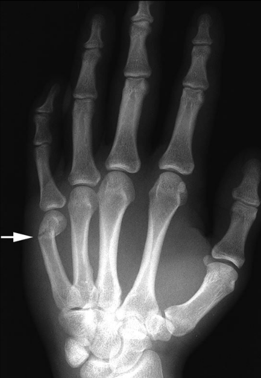
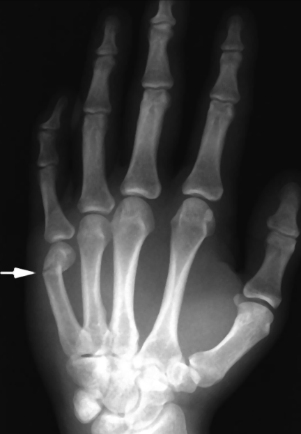
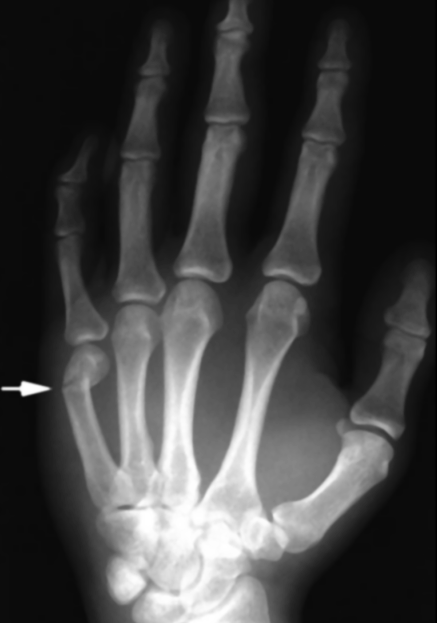
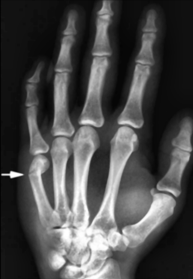
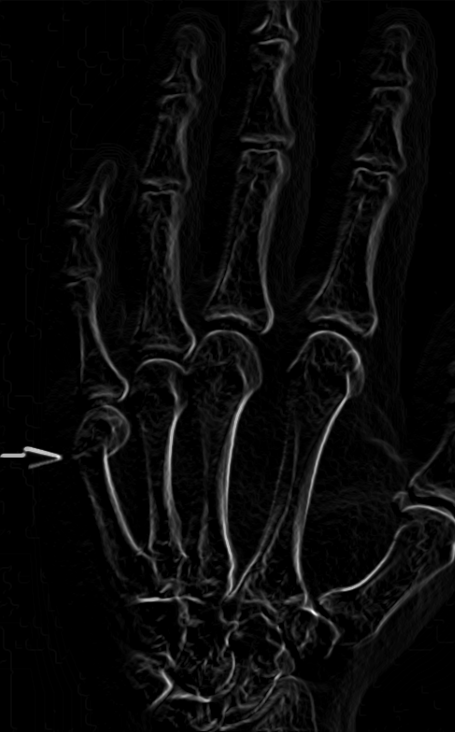
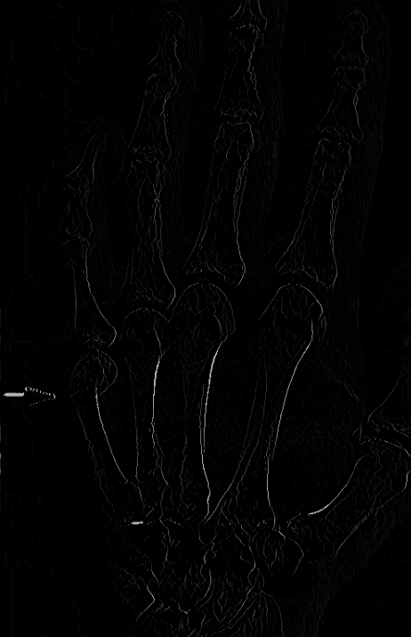
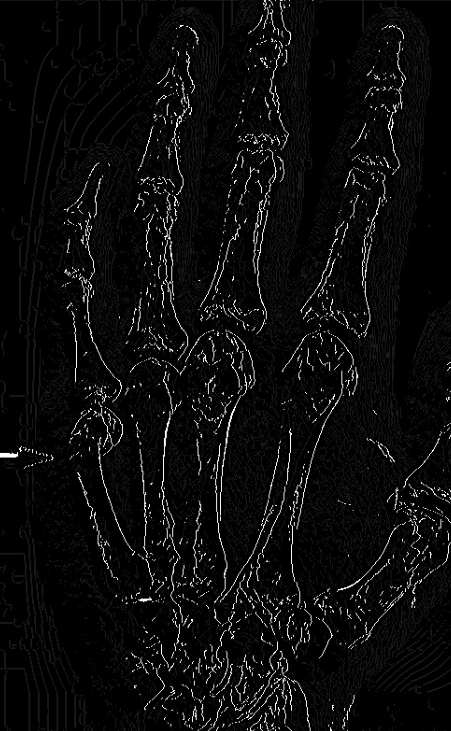
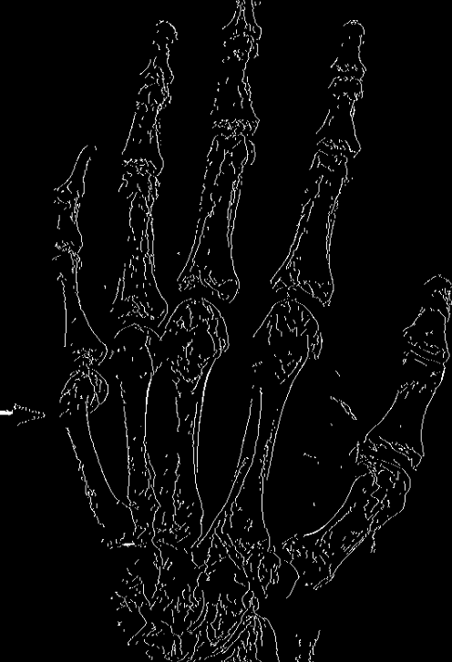
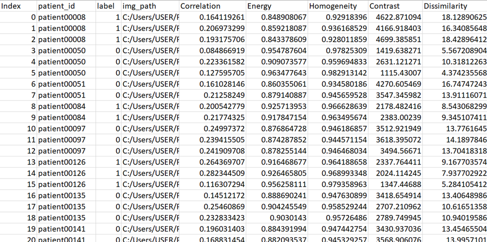
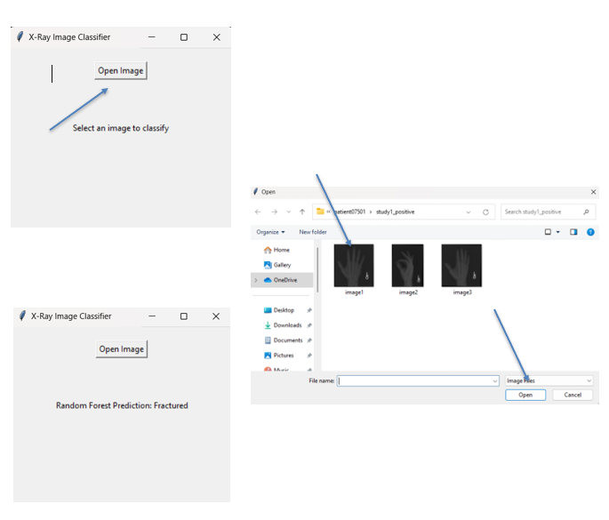

## Introduction

In the field of medical imaging, the accurate classification of X-ray images is crucial for diagnosing conditions such as bone fractures. This project focuses on developing an automated system to classify hand X-ray images as either fractured or not fractured using enough preprocessing and machine learning techniques. By combining image processing techniques with machine learning models like Random Forest, this project aims to provide an efficient and effective tool to assist radiologists in the early detection of fractures, potentially reducing diagnostic time and improving patient outcomes.
## Dataset

The MURA (Musculoskeletal Radiographs) Dataset is a large collection of musculoskeletal radiographs provided by Stanford University, primarily used for training and evaluating machine learning models in medical imaging.
Each image is labeled as either positive (indicating a fracture) or negative (indicating no fracture). The labeling is based on the folder structure:

-  Positive Labels: Images found within the "study_positive" folders are labeled as positive, meaning they show evidence of a fracture.
-	Negative Labels: Images in the "study_negative" folders are labeled as negative, indicating that no fracture is present.
Here in the project only Hand X-ray images were used for simplicity.


## Features

- **Image Preprocessing**:
  - Noise reduction using Median and Gaussian filters.
  - Contrast enhancement with CLAHE (Contrast Limited Adaptive Histogram Equalization).

- **Edge Detection**:
  - Sobel filters to compute gradients.
  - Canny edge detection with non-maximum suppression and hysteresis.

- **Feature Extraction**:
  - GLCM (Gray-Level Co-occurrence Matrix) to extract texture features like Correlation, Energy, Homogeneity, Contrast, and Dissimilarity.

- **Classification**:
  - Random Forest Classifier trained on extracted features with SMOTE for handling class imbalance.

- **Graphical User Interface (GUI)**:
  - Allows users to upload X-ray images for real-time fracture classification.
## Workflow

- **Dataset**:
   - The MURA dataset is used for training and evaluation.
   - Only hand X-rays are included in this implementation.

- **Preprocessing**:
   - Median filtering removes "salt and pepper" noise.
   - Gaussian filtering smooths the image.
   - CLAHE enhances contrast for improved visibility of details.
   - The following diagram shows how the preprocessing of the system is done:

<p align="center">
  <span>
    
  </span>
  <span>
    
  </span>
  <span>
    
  </span>
  <span>
    
  </span>
    <br>
    <em>Fig 1: Original Image , Median Filter Applied, Gaussian Filter Applied, CLAHE Applied</em>
</p>

- **Edge Detection**:
   - Sobel filters compute gradient magnitude and direction.
   - Canny edge detection identifies strong edges with refinement.
    - The following diagram shows edge detection of the system is done:

<p align="center">
  <span>
    
  </span>
  <span>
    
  </span>
  <span>
    
  </span>
  <span>
    
  </span>
    <br>
    <em>Fig 2: Canny Edge Detection Technique </em>
</p>

- **Feature Extraction**:
   - GLCM extracts five key texture features (Correlation, Energy, Homogeneity, Contrast, Dissimilarity).
   - CSV file
  
<p align="center">
  <span>
    
  </span>
    <br>
    <em>Fig 3: Feature Extraction </em>
</p>


- **Classification**:
   - Features are normalized using StandardScaler.
   - The Random Forest Classifier predicts whether an X-ray shows a fracture.

- **GUI**:
   - Users can upload X-ray images to get instant predictions.
     
  <p align="center">
  <span>
    
  </span>
    <br>
    <em>Fig 4: GUI </em>
</p>   

## Installation

- **Clone the repository**:
   ```bash
   git clone https://github.com/your-username bone-fracture-detection.git
   cd bone-fracture-detection
- **Run the GUI for real-time prediction**:
   ```bash
   python main.py

## Code Structure

- **main.py**: Runs the GUI for image upload and classification.
- **featureCSV.py**: Extracts features from the MURA dataset.
- **train_svm.py**: Trains the Random Forest Classifier.
- **GLCM_features.py**: Computes GLCM features from processed images.
- **smoothing_filters.py**: Implements median and Gaussian filters.
- **histogram.py**: Applies histogram equalization and CLAHE.
- **sobel_filter.py**: Detects edges using Sobel filters.
- **canny_edge.py**: Implements Canny edge detection steps.

